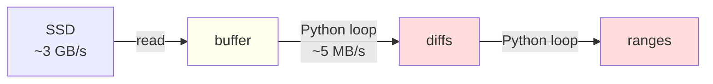
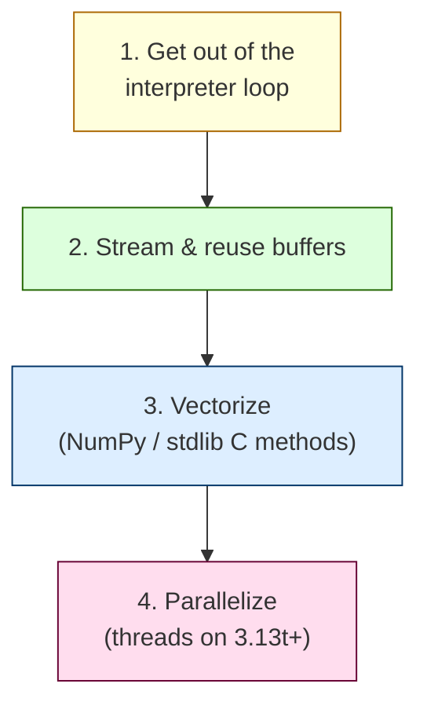

# Python Performance Lab — Sharpening Your Instincts

> Splittable slide source. `---` = one slide. `> note:` = speaker notes.
> Mermaid + ASCII so it survives any export. Numbers measured on CPython
> 3.15t against the repo's real datasets.

---

# PART 0 — Kickoff (30 min)

---

## The plan

```mermaid
gantt
    title 09:00 → 12:30
    dateFormat HH:mm
    axisFormat %H:%M
    section Setup
    Kickoff & harness          :a1, 09:00, 30m
    section Round 1
    Byte-pair histogram        :a2, 09:30, 60m
    section Break
    30 min                     :crit, brk, 10:30, 30m
    section Round 2
    Corruption scanner         :a3, 11:00, 45m
    section Final
    DNA team challenge + wrap  :a4, 11:45, 45m
```



Each round = **demo → sprint → debrief**. ~20% talking, ~70% coding.

---

## What "fast" means

Pick one before you measure.

| Axis           | Knob                          | Today  |
| -------------- | ----------------------------- | ------ |
| **Latency**    | constant-factor work per call | R1     |
| **Throughput** | batching, parallelism         | R2     |
| **Memory**     | streaming, data layout        | R1, R2 |
| **All three**  | combine the above             | R3     |

> note: every round is O(n). The gap baseline→solution is **constants**, not Big-O.

---

## Two benchmarking traps

**1. One sample is not a measurement.** Report a distribution. Median
beats mean for noise; p95 catches GC pauses.

**2. "Faster on my laptop" ≠ faster.** Background apps, CPU throttling,
file cache. Either **pin the machine** or **instrument**.

```python
# wrong
t = time.perf_counter(); fn(); t = time.perf_counter() - t

# right
for _ in range(3): fn()                                # warm
samples = [timed(fn) for _ in range(N)]                # distribution
```

---

## The harness, part 1: `pytest-codspeed`

A pytest plugin. Mark a test, get a benchmark — no separate harness.

```python
def test_bench_compute_histogram(implementation, benchmark):
    result = benchmark(implementation, str(PAYLOAD_PATH))   # times only this
    assert sum(result.values()) > 0                          # correctness too
```

Run it:

```bash
uv run pytest --codspeed rounds/1_histogram/
```

You get `[baseline]` vs `[solution]` side-by-side, every time.

> note: same test file is both the correctness suite and the benchmark suite.
> No drift between "what we test" and "what we measure".

---

## The harness, part 2: the CodSpeed CLI

The plugin alone uses `time.perf_counter` — fine on a quiet laptop, noisy
on a busy one. The **CodSpeed CLI** wraps that with deterministic
instrumentation + auto-profiling, and lets you pick the _right signal_
for what you actually care about.

```bash
curl -fsSL https://codspeed.io/install.sh | sh   # one-time
codspeed auth login                              # link to your account

codspeed run --mode walltime -- uv run pytest --codspeed rounds/1_histogram/
```

CodSpeed ships **four instruments**. Each answers a different question.
Next slides go through them.

[docs](https://codspeed.io/docs/instruments)

---

## Instrument 1 — CPU Simulation (the default in CI)

> _Is my algorithm fundamentally efficient?_

**How.** Runs your code under a CPU simulator (Valgrind fork), counting
every instruction, every cache hit and miss.

**Signals.** Instructions executed · L1/LL cache misses · branch
mispredicts — all hardware-agnostic.

**Variance.** Deterministic. **One run, one number**, identical on every
machine.

**Use it when.** You're catching regressions in CI, or you want to know
whether a change is a real algorithmic win vs. noise. **Today's
instrumented benchmarks all use this.**

> note: same number on a MacBook M3 and an underpowered GitHub runner.
> That's why CodSpeed defaults to this in CI — it makes 1% regressions
> visible.

---

## Instrument 2 — Walltime

> _How fast does this actually run in production?_

**How.** Real elapsed time on a managed bare-metal runner. Warmup +
measurement phases, robust statistics across many runs.

**Signals.** Median / p95 / p99 wall-clock seconds · throughput.

**Variance.** Low on managed hardware (~1–5%), inherently noisy on
your laptop. Reach for it for **macro** benchmarks — anything that does
real I/O, sleeps, or runs > 5 seconds.

**Use it when.** End-to-end timing is what matters. Today's sprints
report this number — it's the one users feel.

```bash
codspeed run --mode walltime -- uv run pytest --codspeed rounds/2_corruption/
```

---

## Instrument 3 — Memory

> _Where is memory being wasted?_

**How.** Tracks allocations and heap usage via eBPF during a single run.
No source changes, no instrumentation overhead worth worrying about.

**Signals.** Peak RSS · total bytes allocated · allocation count ·
growth-over-time curve.

**Variance.** Deterministic — same code, same numbers.

**Use it when.** Round 1 hits this directly: every `data[i:i+2]` is an
allocation. The memory instrument shows exactly how many objects your
hot loop builds and tears down.

> note: a fast wrong answer can still OOM. Round 2's 1 GB stretch goal
> is unsolvable without watching this.

---

## Instrument 4 — Database (not today, but worth knowing)

> _Which queries are slowing my app down?_

**How.** Ad-hoc overlay on top of a walltime or simulation run. Captures
every SQL query the code executes during the benchmark.

**Signals.** Query count · per-query latency · N+1 patterns ·
result-set sizes.

**Variance.** Same as the underlying executor instrument.

**Use it when.** You suspect the bottleneck is in the database, not the
Python code wrapping it. **No DB in this tutorial — but expect to use
this on real apps.**

---

## Why CodSpeed for this room

| You want                          | Without CodSpeed                   | With CodSpeed    |
| --------------------------------- | ---------------------------------- | ---------------- |
| One number you trust              | warmup loops, stats, retries       | `codspeed run`   |
| Flame graph of the hot path       | `py-spy`, `cProfile` (separately)  | shipped, auto    |
| The right signal for your goal    | pick CPU vs memory vs wall by hand | `--mode <inst>`  |
| Compare baseline vs your solution | manual diff of two runs            | side-by-side     |
| Catch a 3% regression in CI       | very hard                          | the design point |

You'll still reach for `cProfile` or `py-spy` occasionally — but
**today, CodSpeed is the only measurement tool you need.**

---

## The mental model for the day

> _Move work out of the Python interpreter loop._

Every Python iteration does:

```
   fetch bytecode → type-check → box result (alloc + refcount)
                ↘             ↓            ↙
                  ~50–200 ns per op, every op
```

Three ways to escape that loop:

1. **Smaller data** → fewer ops.
2. **Stdlib methods** that do your loop in C (`bytes.find`, `bytearray.translate`).
3. **NumPy** when the shape is "do this same thing to N numbers".

---

# PART 1 — Round 1: Byte-pair histogram (45 min)

_Theme: data representation + memory._

---

## The problem

Count every **2-byte bigram** in a 10 MB binary file. A bigram is a
sliding 2-byte window.

```
bytes:    H  e  l  l  o     w  o  r  l  d
          └──┘
             └──┘
                └──┘
                   └──┘   ←  N bytes → N-1 bigrams
```

Universe: 256 × 256 = **65,536** possible keys.
Output: `dict[bytes, int]` of `{bigram → count}`.

---

## The baseline

```python
def compute_histogram(path: str) -> dict[bytes, int]:
    with open(path, "rb") as f:
        data = f.read()

    counts: dict[bytes, int] = {}
    for i in range(len(data) - 1):
        bigram = data[i : i + 2]          # ① allocates per step
        if bigram in counts:              # ② hashes bytes per step
            counts[bigram] += 1
        else:
            counts[bigram] = 1
    return counts
```

Two anti-patterns, ~10 million times each.

---

## Big idea: every object has a body

A 2-byte bigram is **35 bytes** in memory, not 2.

| Object                   | `sys.getsizeof` |
| ------------------------ | --------------: |
| `b""` (empty bytes)      |            33 B |
| `b"ab"`                  |        **35 B** |
| any int (`0`, `65535`)   |            28 B |
| `dict` w/ 65,536 entries |     **~2.6 MB** |
| `array("I", [0]*65536)`  |      **256 KB** |

10 MB of input → 10⁷ bigram allocs × ~35 B = **~350 MB of churn**.
The GC earns its salary.

---

## Big idea: pack two bytes into an int

Two bytes fit in 16 bits. So the bigram **is** an integer 0–65,535.

```
bytes:        0x68      0x69          ("hi")
binary:    01101000  01101001
            << 8       │
shifted:   01101000  00000000  =  0x6800
or right:        ╲     │
                  ╲    ▼
combined:  01101000  01101001  =  0x6869  →  index 26 729
```

```python
key = (b0 << 8) | b1     # int 0..65535
counts[key] += 1         # array index, not a hash lookup
```

---

## dict[bytes] vs array[int]

```
┌─────────────────────────────┐   ┌─────────────────────────────┐
│  dict[bytes, int]            │   │  array("I", [0]*65536)       │
│                              │   │                              │
│  ┌──┐ ┌──┐ ┌──┐ hash table   │   │  ┌──┬──┬──┬──┬──┬──┬──┬──┐  │
│  │ab│→│cd│→│ef│ + slack      │   │  │ 0│ 0│ 7│ 0│42│ 0│ 1│ 0│  │
│  └──┘ └──┘ └──┘              │   │  └──┴──┴──┴──┴──┴──┴──┴──┘  │
│   +35B  +35B  +35B (keys)   │   │  4 bytes per slot             │
│   +28B  +28B  +28B (values) │   │                              │
│   hash on every read+write   │   │  index = (b0<<8)|b1          │
└─────────────────────────────┘   └─────────────────────────────┘
        ~2.6 MB, hashing                  256 KB, indexing
```

Same answer. **10× less memory, no hashing, no allocation in the loop.**

---

## memoryview: slice without copying

```python
data = f.read()              # one bytes object, 10 MB

mv = memoryview(data)        # zero-copy view over the same memory
mv[i]                        # → int (no alloc)
mv[i:i+2]                    # → memoryview (no alloc)
```

```
data:   [████████████████████████████]   one 10 MB bytes obj
              ↑
              │
mv:     [─ window ─]   memoryview into data — no copy
```

`memoryview` is to `bytes` what NumPy slicing is to an `ndarray`.

---

## Vectorize: numpy.bincount

When the shape fits, one C call replaces the entire loop.

```python
import numpy as np

data = np.fromfile(path, dtype=np.uint8)                 # zero-copy from disk
bigrams = (data[:-1].astype(np.uint32) << 8) | data[1:]
counts = np.bincount(bigrams, minlength=65536)           # one C call
```

```
[ …, 0x68, 0x69, 0x6c, 0x6c, 0x6f, … ]
       \   /\   /\   /\   /
      [0x6869, 0x696c, 0x6c6c, 0x6c6f, … ]
                     │
                     ▼   bincount → counts[26 729]++ …
```

> note: works because the problem _is_ "count occurrences of integers in a small range".

---

## Round 1 — Measured (10 MB, CPython 3.15t)

| Step                                      |      Time | vs. baseline |
| ----------------------------------------- | --------: | -----------: |
| Baseline (slice + dict)                   |    925 ms |         1.0× |
| `memoryview` + int packing + `array("I")` |    670 ms |         1.4× |
| `numpy.bincount`                          | **34 ms** |      **27×** |

Each row strips one source of per-byte Python work.

```bash
$EDITOR rounds/1_histogram/solution.py
uv run pytest rounds/1_histogram/                  # correctness
uv run pytest --codspeed rounds/1_histogram/       # bench
```

---

# PART 2 — Round 2: Corruption scanner (45 min)

_Theme: keep the CPU busy. I/O + vectorization + parallelism._

---

## The problem

Two equal-sized binary files: `reference.bin` (known good) and
`corrupted.bin` (maybe damaged). Return every byte range where they differ.

```
reference   A B C D E F G H I J K
corrupted   A B X Y E F G Z I J K
                ─┬─       ┬
            (off=2,len=2) (off=7,len=1)

output:  [(2, 2), (7, 1)]
```

- Inputs: 64 MB each by default. **1 GB stretch goal** — won't fit twice in RAM.
- Output: `list[(offset, length)]`, sorted, merged.

---

## The baseline

```python
def find_corruptions(ref_path, cor_path):
    with open(ref_path, "rb") as f: ref = f.read()    # slurp
    with open(cor_path, "rb") as f: cor = f.read()    # slurp

    diffs = []
    for i in range(len(ref)):                          # Python byte loop
        if ref[i] != cor[i]:
            diffs.append(i)
    # … range-merging in pure Python …
```

Three failure modes: **2× peak RSS**, **per-byte Python loop**, giant
intermediate list.

---

## The CPU is bored



Disk delivers ~3 GB/s. Python byte-loop processes ~5 MB/s. **99% of CPU
time = bytecode dispatch, not byte comparison.**

---

## Lever #1 — Stream + reuse buffers

```python
CHUNK = 4 << 20                          # 4 MB
buf_r = bytearray(CHUNK); mv_r = memoryview(buf_r)
buf_c = bytearray(CHUNK); mv_c = memoryview(buf_c)

with open(ref_path, "rb") as fr, open(cor_path, "rb") as fc:
    offset = 0
    while (n := fr.readinto(buf_r)) and fc.readinto(buf_c):
        # compare mv_r[:n] vs mv_c[:n]
        offset += n
```

Two buffers, refilled in place. **Peak RSS = 8 MB**, file size irrelevant.

---

## Lever #2 — Vectorize the compare

```python
a = np.frombuffer(buf_r, dtype=np.uint8, count=n)
b = np.frombuffer(buf_c, dtype=np.uint8, count=n)
diff = a != b                            # one C call, SIMD inside
```

From mask to `(offset, length)` ranges in one vectorized pass:

```
diff:    [0 0 1 1 0 0 0 1 0 0 1 1 1 0]
            ─┬─       │      ──┬──
        (off=2,len=2) (off=7,len=1) (off=10,len=3)
```

```python
padded = np.r_[False, diff, False]
edges  = np.diff(padded.astype(np.int8))
starts = np.flatnonzero(edges ==  1)
ends   = np.flatnonzero(edges == -1)
```

**Python loop on 5 MB: 157 ms · NumPy `a != b`: 1.1 ms** (~140×).

---

## Lever #3 — Parallelize across cores

CPython 3.13 shipped free-threaded as experimental. 3.14 made it
**supported**. **3.15t is what this workshop ships.** The GIL is gone.

```python
from concurrent.futures import ThreadPoolExecutor

with ThreadPoolExecutor(max_workers=8) as ex:
    results = list(ex.map(scan_chunk, chunk_offsets))
```

```
file:   ┌─────────┬─────────┬─────────┬─────────┐
        │ chunk 0 │ chunk 1 │ chunk 2 │ chunk 3 │
        └────┬────┴────┬────┴────┬────┴────┬────┘
             ▼         ▼         ▼         ▼
          worker 1  worker 2  worker 3  worker 4
                       │
                       ▼
                  merge + stitch
```

> note: same code on the GIL build = serialized. The free-threaded build
> has ~5% single-thread overhead but scales with cores.

---

## Boundary stitching

A run that crosses a chunk seam must be glued back.

```
chunk N            │   chunk N+1
                   │
 …  ─ ─ ─ ─ █████│██ ─ ─ ─  …
                   │
              this run spans the cut

  worker N:    (offset=k,    len=5)
  worker N+1:  (offset=k+5,  len=2)

  merge: if prev.offset + prev.len == this.offset → fuse
         → (offset=k, len=7)
```

Sort by offset; coalesce when contiguous. Done.

---

## Round 2 — Measured (64 MB, M1 laptop)

| Step                           |     Time | vs. baseline |
| ------------------------------ | -------: | -----------: |
| Baseline (slurp + Python loop) | ~5000 ms |         1.0× |
| Stream + NumPy compare         |   ~70 ms |          70× |
| + 4 threads (3.15t)            |   ~20 ms |         250× |
| + 8 threads                    |   ~14 ms |         350× |

Memory: **2 × 64 MB → 8 MB** flat.

```bash
$EDITOR rounds/2_corruption/solution.py
uv run pytest rounds/2_corruption/
uv run pytest --codspeed rounds/2_corruption/
```

> note: re-measure on the day's hardware. Numbers above are the shape.

---

# PART 3 — Round 3: DNA matcher (45 min, team challenge)

_Theme: everything together. Live leaderboard._

---

## The problem

FASTA-like file of DNA (alphabet `A C G T`) + a target pattern.
Return every record containing the pattern, with positions.

```
>seq_000001
ACGTACGTACGTAGTCCGTAACGT...
ACGTACGT...
>seq_000002
GTACGTAC...
>seq_000003
AGTCCGTAACGTAGTCCGTA...
```

- Input: `genome.fasta` (~512 MB; scales to GBs)
- Pattern: `b"AGTCCGTA"`
- Output: `[(record_id, [positions]), …]`

---

## The baseline

```python
def find_matches(fasta_path, pattern):
    pattern_str = pattern.decode("ascii")               # ① bytes → str
    with open(fasta_path, "r") as f:                    # ② text mode
        text = f.read()                                  # ③ slurp 512 MB

    for record in text.split(">"):                       # ④ giant split
        ...
        sequence = "".join(lines[1:]).replace(" ", "")   # ⑤ rebuild str
        # then sequence.find in a loop
```

Every anti-pattern from R1+R2, **plus** splitting a 512 MB string into a
list of 512 MB of substrings.

---

## Lever #1 — Let CPython do the search

`bytes.find()` uses an enhanced **Crochemore–Perrin two-way** algorithm.
Linear worst case, implemented in C, SIMD on the fast path.

| Method                                   | Time (100 MB) |
| ---------------------------------------- | ------------: |
| Pure-Python `hay[i:i+8] == pattern` loop |      ~3500 ms |
| `re.finditer(re.escape(pattern), hay)`   |         44 ms |
| `bytes.find(pattern)` (one call)         |    **1.4 ms** |

```python
positions, start = [], 0
while (i := hay.find(pattern, start)) != -1:
    positions.append(i)
    start = i + 1
```

**~2500× over the Python loop**, for one line of code.

---

## Lever #2 — Parse FASTA on the fly

Don't `.split(">")` a 512 MB string. Walk pointers.

```python
def iter_records(buf: memoryview):
    i = 0
    while i < len(buf):
        if buf[i:i+1] == b">":
            j = buf.find(b"\n", i)                # end of header
            k = buf.find(b">", j)                  # start of next
            yield bytes(buf[i+1:j]).rstrip(), buf[j+1:k if k>=0 else len(buf)]
            i = k if k >= 0 else len(buf)
```

`buf.find()` is C-level. Slicing a `memoryview` is a pointer + length —
no copy, no alloc.

---

## Lever #3 — Chunked streaming with overlap

Patterns can straddle chunk boundaries.

```
chunk N            │   chunk N+1
                   │
   …XYZAGTCCGTAB │ CDEFG…
              ▲▲▲│
              ╲╲╲│   the pattern AGTCCGTA crosses the cut
              we'd miss it if we scanned chunks in isolation
```

**Fix:** each chunk includes the last `len(pattern) - 1` bytes of the previous one.

```python
OVERLAP = len(pattern) - 1                # 7 for "AGTCCGTA"
```

Same boundary-stitching pattern as R2, different costume.

---

## Lever #4 — Parallelize the chunks

```
file:  ┌──────────┬──────────┬──────────┬──────────┐
       │ chunk+OV │ chunk+OV │ chunk+OV │ chunk    │
       └────┬─────┴────┬─────┴────┬─────┴────┬─────┘
            ▼          ▼          ▼          ▼
         worker 1   worker 2   worker 3   worker 4
         local pos  local pos  local pos  local pos
                     │
                     ▼
              merge by record_id
```

Near-linear scaling on 3.15t because the inner loop is pure C
(`bytes.find`). Threads don't fight for the interpreter.

---

## Round 3 — Measured (512 MB, sketch)

| Step                              |    Time | vs. baseline |
| --------------------------------- | ------: | -----------: |
| Baseline (str + split + str.find) |   ~20 s |         1.0× |
| Bytes + `bytes.find` in a loop    | ~150 ms |         130× |
| + streaming chunks with overlap   | ~120 ms |         165× |
| + 4 threads (3.15t)               |  ~40 ms |         500× |
| + 8 threads, bigger chunks        |  ~25 ms |         800× |

The big jump is **Lever #1**: stop doing the search yourself.

---

## Round 3 — Sprint

Teams of 2–4. Live leaderboard as you push.

Suggested attack order:

1. **Stay in bytes, use `bytes.find`.** Single biggest win.
2. **Stream with overlap.** Memory drops.
3. **Parallelize.** Only after the serial version is tight.

```bash
$EDITOR rounds/3_dna/solution.py
uv run pytest rounds/3_dna/
uv run pytest --codspeed rounds/3_dna/
```

---

# PART 4 — Wrap-up (15 min)

---

## The four levers, ranked



Best-leverage to worst. Exhaust the layer above before the next.

---

## "What to try first" — a checklist

Before code:

- [ ] **Measure.** `codspeed run` for the number; the flame graph it
      ships points at the hot path. (`py-spy` / `cProfile` if you need
      to dig deeper outside CI.)
- [ ] **Find the hot loop.** 80% of the time is in one place.

Then, in order:

- [ ] Can I stay in **bytes** instead of `str`?
- [ ] Can I **stream** instead of slurp?
- [ ] Can I replace `dict` / `list` with `array` / `numpy` / `bytearray`?
- [ ] Is there a **stdlib method** that already does my loop in C?
- [ ] Can I **vectorize** with NumPy?
- [ ] Can I **parallelize** (free-threaded threads or processes)?

---

## When _not_ to optimize

- Code that runs once, off the hot path.
- Code where the bottleneck is **outside Python** (network, DB, disk).
- Code where readability cost > speed win.

**If you can't measure the win, you didn't win.**

---

## Resources

- [Free-threaded Python (docs)](https://docs.python.org/3/howto/free-threading-python.html)
- [PEP 703 — Making the GIL optional](https://peps.python.org/pep-0703/)
- [CPython `bytes.find` (two-way algorithm)](https://github.com/python/cpython/blob/main/Objects/stringlib/stringlib_find_two_way_notes.txt)
- [pythonspeed.com — Vectorization](https://pythonspeed.com/articles/vectorization-python/)
- [CodSpeed — How to benchmark Python code](https://codspeed.io/docs/guides/how-to-benchmark-python-code)

Python's performance ceiling is much higher than its reputation — _if_
you know which loops to take out of the interpreter, and which data
shapes the stdlib already handles in C.

Go find a slow function this week.
